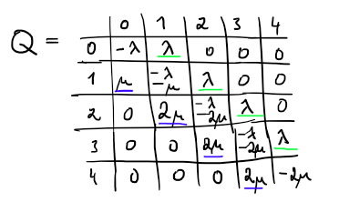
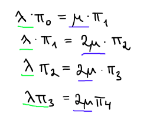

TARGET DECK: NI-SZZ
FILE TAGS: NI-SPOL-09 NI-VSM

> NI-SPOL-09 (NI-VSM)
> Markovské řetězce se spojitým časem. Souvislost s Markovskými řetezci s diskrétním časem a s Poissonovým procesem.

<!--
TODO:
- přidat co mi říká matice skokových intenzit (už je to v kartičce definice, ale oddělit to do samostatné kartičky)
-->

## Markovské řetězce se spojitým časem

<!--
Original Flashcard ID: 1746599649688
-->

START
NI-SZZ

Definice: **Markovský řetězec se spojitým časem**

Back:

<!--ID: 1778521859473-->
END

---

<!--
Original Flashcard ID: 1746599649695
-->

START
NI-SZZ

Věta: **náhodný (_spojitý_) proces je markovský právě tehdy když**

Back:

<!--ID: 1778521859476-->
END

---

<!--
Original Flashcard ID: 1746599649701
-->

START
NI-SZZ

Věta: **Chapman-Kolmogorov** (pro spojité markovské řetězce)

Back:

<!--ID: 1778521859478-->
END

---

<!--
Original Flashcard ID: 1746599649708
-->

START
NI-SZZ

Definice: **Homogenní markovský řetězec** (pro spojité markovské řetězce)

Back:

Tzn. je jakoby jedno kde v tom řetězci začnu

<!-- ExampleStart -->

<!-- ExampleEnd -->
<!--ID: 1778521859481-->
END

---

<!--
Original Flashcard ID: 1746599649715
-->

START
NI-SZZ

Definice: **Matice skokových intenzit**

Back:

Co mi to říká:

<!-- ExplanationStart -->

Matice intenzit mi říká několik věcí:

1. Jak rychle se kam systém přesouvá mezi jednotlivými časy.
2. Jak dlouho průměrně zůstanu v daném stavu (na diagonále)
3. Jaká je pravděpodobnost přechodu do jiného stavu.
<!-- ExplanationEnd -->

<!-- DetailInfoStart -->

<!-- DetailInfoEnd -->

<!-- ExampleStart -->

<!-- ExampleEnd -->
<!--ID: 1778521859484-->
END

---

<!--
Original Flashcard ID: 1748180445895
-->

START
NI-SZZ

Jak lze spočíst $\textbf{Q}$, pokud známe $\textbf{P}(0)$?

Back:

$$\textbf{Q}=\textbf{P}'(0)$$

Tzn. prostě zderivuju každý prvek té matice $\textbf{P}$
<!--ID: 1778521859486-->
END

---

<!--
Original Flashcard ID: 1746599649722
-->

START
NI-SZZ

Věta: **Simulace procesu pomocí skokových intenzit**

Jak se z $\textbf{Q}$ dostane:

- Čas do výskoku z $i$
- Pravděpodobnost skoku z $i$ do $j$

Back:

1. $-\textbf{Q}_{ii}$
2. $\frac{\textbf{Q}_{ij}}{-\textbf{Q}_{ii}}$

<!--ID: 1778521859489-->
END

---

<!--
Original Flashcard ID: 1746599649435
-->

START
NI-SZZ

Věta: **Kolmogorova rovnice**

Back:

<!--ID: 1778521859492-->
END

---

<!--
Original Flashcard ID: 1746599649443
-->

START
NI-SZZ

Důsledek: rozdělení $p(t)$ a diferenciální rovnice

Back:

<!-- ExerciseStart -->

<!-- ExerciseEnd -->
<!--ID: 1778521859495-->
END

---

<!--
Original Flashcard ID: 1746599649451
-->

START
NI-SZZ

Věta: **čemu je rovna matice přechodu** $P(t)$

(řešení kolmogorových rovnic)

Back:

<!-- ExerciseStart -->

<!-- ExerciseEnd -->
<!--ID: 1778521859497-->
END

---

<!--
Original Flashcard ID: 1746599649457
-->

START
NI-SZZ

Definice: **stacionární rozdělení** (spojitý čas)

Back:

<!--ID: 1778521859500-->
END

---

<!--
Original Flashcard ID: 1746599649465
-->

START
NI-SZZ

Věta: Vektor $\pi$ **je stacionárním rozdělením právě tehdy když** (spojitý čas)

Back:

<!--ID: 1778521859503-->
END

---

<!--
Original Flashcard ID: 1746599649473
-->

START
NI-SZZ

Definice: **Markovský řetězec je nerozložitelný** (spojitý čas)

Back:

<!--ID: 1778521859506-->
END

---

<!--
Original Flashcard ID: 1746599649480
-->

START
NI-SZZ

Důsledek: Co stačí aby platilo, aby existovalo stacionární rozdělení pro markovský řetězec se spojitým časem?

Back:

<!--ID: 1778521859508-->
END

---

<!--
Original Flashcard ID: 1746599649487
-->

START
NI-SZZ

Pozorování: **detailní rovnováha**

Back:

<!-- DetailInfoStart -->

<!-- DetailInfoEnd -->

<!-- ExerciseStart -->

<!-- ExerciseEnd -->
<!--ID: 1778521859511-->
END

---

<!--
Original Flashcard ID: 1747933518476
-->

START
NI-SZZ

Jak z $\textbf{Q}$ dostaneme stacionární rozdělení $\pi$ (pomocí detailní rovnováhy)

Back:

1. **Víme** že $\pi_1 + \pi_2 + \dots \pi_k = 1$
2. **Vypíšeme rovnice** podle prvků kolem diagonály
3. **Dosazováním rovnic** do sebe vypočítáme postupně všechny prvky $\pi$

**Vypsání rovnic**:

**Posrtupný dosazování:**

<!--ID: 1778521859514-->
END

---

<!--
Original Flashcard ID: 1746599649494
-->

START
NI-SZZ

Lemma: Pokud máme nezávislé exponenciální rozdělení $T$ a $S$, potom ...

$$Z := \min\{T,S\} \sim \ ???$$

Back:

To samé platí obecněji:

<!--ID: 1778521859516-->
END

---

<!--
Original Flashcard ID: 1746599649510
-->

START
NI-SZZ

Pozorování: co platí pro $F_\text{max{X,Y}}(t)$

Back:

<!--ID: 1778521859519-->
END

---

<!--
Original Flashcard ID: 1746599649517
-->

START
NI-SZZ

Lemma: Čemu je rovno $P(T<S)$ a $P(S<T)$ pro $S,T$ exponenciální?

Back:

$P(T<S)$ znamená, že $T$ vyhraje "závod"
<!--ID: 1778521859522-->
END

---

<!--
Original Flashcard ID: 1746599649523
-->

START
NI-SZZ

Důsledek: čemu je rovno $P(T_i=min\{T_1, \dots T_n\})$

Back:

Neboli že $T_i$ vyhraje závod ze všech závodníků
<!--ID: 1778521859524-->
END

---

<!--
Original Flashcard ID: 1746599649532
-->

START
NI-SZZ

Lemma: Nezávislost ${min\{T,S\}>u}$ a $T<S$

Back:

**Jinými slovy:** Představme si 2 závodníky, co doběhnou v časech $T$ a $S$

Lemma pak říká, že pro $u \geq 0$ jsou nezávislé následující dvě věci:
- Jak dlouhý čas měl vítěz (že byl delší než $u$)
- Kdo vyhrál závod (že $T < S$ - tedy že závodník $T$ byl rychlejší)
<!--ID: 1778521859527-->
END

---

<!--
Original Flashcard ID: 1746599649540
-->

START
NI-SZZ

Důsledek: Buďte $T_1, \dots, T_n$ nezávislé veličiny, pak jevy... jsou nezávislé

(aneb obecně nezávislost nejlepšího času a nejlepšího závodníka)

Back:

<!-- ExerciseStart -->

<!-- ExerciseEnd -->
<!--ID: 1778521859529-->
END

---

<!--
Original Flashcard ID: 1746599649562
-->

START
NI-SZZ

Pozorování: souvislost markovského řetězce se spojitým časem a exponenciálními závody

proces je markovský řetězec se spojitým časem $\Leftrightarrow \dots$

Back:

<!-- ExplanationStart -->
Protože:
1. Jsme v nějakém stavu
2. Generujeme náhodný čas $t$ podle exponenciálního rozdělení (to je jakoby čas vítěze)
3. Pak přeskočíme do dalšího stavu (ten stav co vyhrál)

Tohle furt opakujeme, takže každý přesun do dalšího stavu je jakoby závod.
<!-- ExplanationEnd -->

Pozn. Co po nás podle Hrabáka budou chtít:

- Buď dostanem matici přechodu za čas T
  - Např. Rozdělení v čase 17,5 když známe rozdělení v čase 2 (stačí jen vynásobit maticí vývoje za čas - tzn. P(17,5-2))
- Nebo dostanem diagram. Z toho uděláme matici skokových intenzit
  - Z toho třeba budou chtít sestavit diferenciální rovnice

<!-- DetailInfoStart -->

<!-- DetailInfoEnd -->

<!-- ExampleStart -->

<!-- ExampleEnd -->
<!--ID: 1778521859532-->
END

---

## Souvislost s Markovskými řetezci s diskrétním časem a s Poissonovým procesem

<!--
Original Flashcard ID: 1746599649602
-->

START
NI-SZZ

Jak funguje **binomický proces** jako **markovský řetězec**?

Back:

V každém čase hodíme mincí, pokud padne hlava, přičteme 1 (tzn. přesuneme se do stavu o 1 výše).

<!-- DetailInfoStart -->

<!-- DetailInfoEnd -->
<!--ID: 1778521859535-->
END

---

<!--
Original Flashcard ID: 1746599649609
-->

START
NI-SZZ

Definice: **Čítací proces**

Back:

Počítá mi kolik událostí nastalo do daného času

<!-- DetailInfoStart -->

<!-- DetailInfoEnd -->
<!--ID: 1778521859537-->
END

---

<!--
Original Flashcard ID: 1746599649617
-->

START
NI-SZZ

Definice: **Poissonův proces**

Back:

<!-- ExplanationStart -->
$X_j$ je náhodná veličina s rozdělením $\text{Exp}(\lambda)$, která určuje ty časy mezi příchody (např. zákazníků do obchodu)
- i.i.d = jsou nezávislé a se stejným rozdělením
$T_n$ je pak čas kdy nastane $n$-tá událost (příchod).
- Ten se spočítá buď že vezmu čas předchozího příchodu a přičtu k tomu ten náhodný čas dalšího příchodu $T_{n-1}+X_n$
- Nebo se spočte jako že sečtu časy všech příchodů do té události $\sum_{j=1}^nXj$
$N_t$ pak znamená, kolik událostí nastalo do času $t$.
- $\omega$ je konkrétní hodnota náhodné veličiny $N_t$, tzn. jakoby ta konkrétní náhoda

$\lambda$ mi určuje jak rychle chodí ty události. 
- Pokud je vyšší, chodí častěji
- Pokud je nižší, chodí méně často

Poissonův proces je podobný čítacímu procesu, jen v tom stavu vždy zůstává nějaký spojitý čas.

Např. počítáme příchody zákazníků do obchodu, takže vždy přijde jeden, pak nějakou dobu nic, pak přijde druhý atd. a my sčítáme třeba příchody za den

<!-- ExplanationEnd -->
<!--ID: 1778521859540-->
END

---

<!--
Original Flashcard ID: 1746599649625
-->

START
NI-SZZ

Definice: **Poissonův proces 2**

Back:

Definujeme to vlastně podle "přírůstků" těch počtů, které jsou mezi dvěma časy podle Poissonova rozdělení
<!--ID: 1778521859543-->
END

---

<!--
Original Flashcard ID: 1746599649632
-->

START
NI-SZZ

Jak se liší **Binomický** a **Poissonův** proces?

Back:

Rozdělením času mezi událostmi.

- U binomického v každé "sekundě" flipneme coin a přičteme nebo nepřičteme hodnotu
- U poissonova přičteme v náhodném čase o 1 (čas může být i třeba 0.5).

Tzn. poisson je jakoby spojitá varianta binomického.

<!-- DetailInfoStart -->

<!-- DetailInfoEnd -->
<!--ID: 1778521859545-->
END

---

<!--
Original Flashcard ID: 1746599649638
-->

START
NI-SZZ

Definice: **Exponenciální rozdělení**

- předpis
- parametry
- jak je definováno ($f_X(x)$)
- střední hodnota
- rozptyl

Back:

**Předpis**: $X \sim Exp(\lambda)$
**Parametry**:

- $\lambda > 0$
  **Definice**:
- $f_X(x) = \lambda e^{-\lambda x} \quad x \in [0, \infty), \ 0$ jinde
  **Střední hodnota:**
- $EX=\frac{1}{\lambda}$
- $varX=\frac{1}{\lambda^2}$

<!-- DetailInfoStart -->

<!-- DetailInfoEnd -->
<!--ID: 1778521859548-->
END

---

<!--
Original Flashcard ID: 1748188849403
-->

START
NI-SZZ

Jaká je distribuční funkce exponenciálního rozdělení?

(v jedné zkoušce to bylo potřeba jako součást praktického příkladu)

Back:

<!--ID: 1778521859551-->
END

---

<!--
Original Flashcard ID: 1746599649646
-->

START
NI-SZZ

Věta: **Bezpaměťovost exponenciálního rozdělení**

Back:

Tzn. čas čekání $T$ nezávisí na tom, jak dlouho jsme už čekali (tedy na $t$)
<!--ID: 1778521859553-->
END

---

<!--
Original Flashcard ID: 1746599649654
-->

START
NI-SZZ

Věta: Silná bezpaměťovost exponenciálního rozdělení

Back:

Tzn. čas čekání $T$ nezávisí na jakékoliv nezáporné nezávislé veličině $A$
<!--ID: 1778521859556-->
END

---

<!--
Original Flashcard ID: 1746599649660
-->

START
NI-SZZ

Věta: **Součet exponenciálních je gamma**

Back:

Nechť $X_1,X_2 \dots$ i.i.d kde $X_j \sim$ Exp($\lambda$). Pak

$$X_1 + X_2 + \dots + X_n \sim \text{Ga}(\lambda,n)$$

Neboli součet exponenciálních rozdělení má gamma rozdělení.

<!-- DetailInfoStart -->

<!-- DetailInfoEnd -->
<!--ID: 1778521859559-->
END

---

<!--
Original Flashcard ID: 1746599649667
-->

START
NI-SZZ

Věta: **Ekvivalence definic Poissonova procesu**

Back:

Pokud jsou splněny podmínky jedné definice, tak pro ní platí vlastnosti druhé definice. A naopak.

<!-- DetailInfoStart -->

<!-- DetailInfoEnd -->
<!--ID: 1778521859561-->
END

---

<!--
Original Flashcard ID: 1746599649674
-->

START
NI-SZZ

Lemma: **Jaké rozdělení má náhodná veličina** $N_s$ (z poissonova procesu)

Back:

<!--ID: 1778521859564-->
END

---

<!--
Original Flashcard ID: 1746599649680
-->

START
NI-SZZ

Lemma: **Bezpaměťovost Poissonova procesu**

Back:

<!--ID: 1778521859567-->
END

---

<!--
Original Flashcard ID: 1746599649571
-->

START
NI-SZZ

Pozorování: Jak vytvoříme **homogenní markovský proces se spojitým časem**

Back:

<!--ID: 1778521859569-->
END

---

<!--
Original Flashcard ID: 1746599649579
-->

START
NI-SZZ

Pozorování: Jaký tvar má **matice přechodu homogenního markovského řetězce se spojitým časem** ($X_t=Y_{N_t}$)

Back:

<!--ID: 1778521859572-->
END

---

<!--
Original Flashcard ID: 1746599649591
-->

START
NI-SZZ

Pozorování: Jaký tvar má **matice skokových intenzit homogenního markovského řetězce se spojitým časem** ($X_t=Y_{N_t}$)

Back:

<!--ID: 1778521859574-->
END

---

START
NI-SZZ

Co znamená že veličiny jsou $\text{i.i.d.}$?

Back:

Že jsou **nezávislé** a **mají stejné rozdělení**.

Např. $X_1, X_2, \dots X_n$ mohou být i.i.d. a mít rozdělení $\text{Exp}(\lambda)$
<!--ID: 1778762614288-->
END

---
